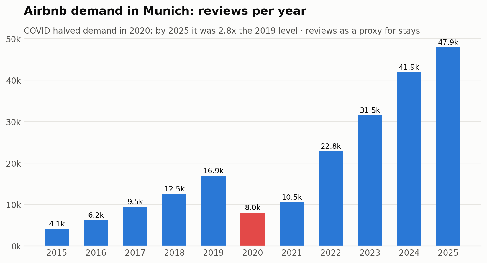
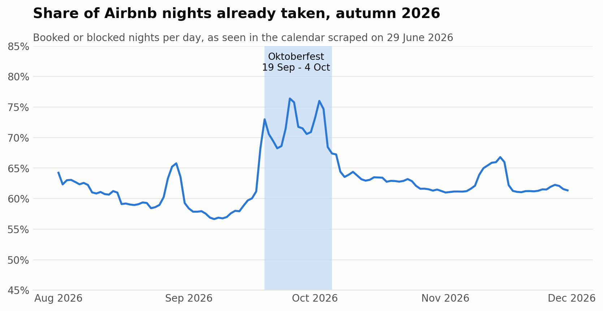
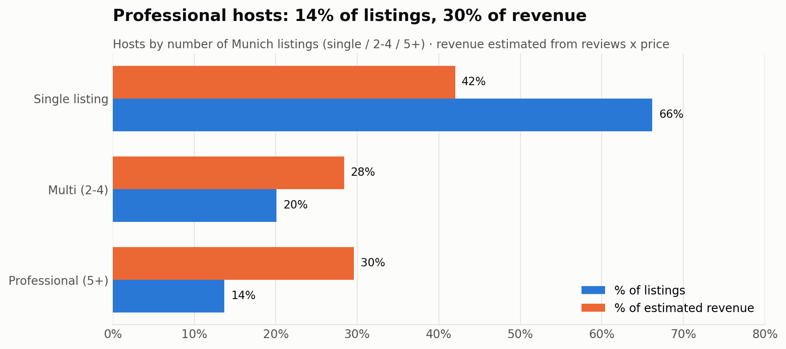
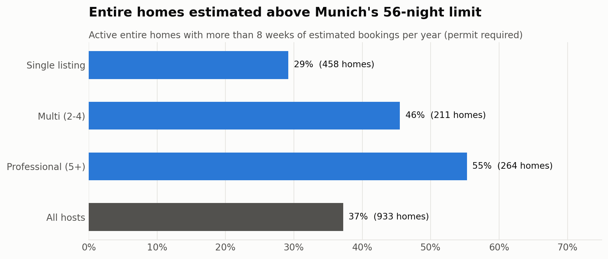
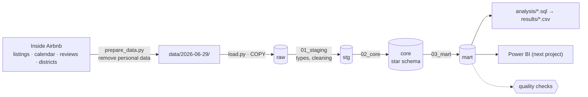
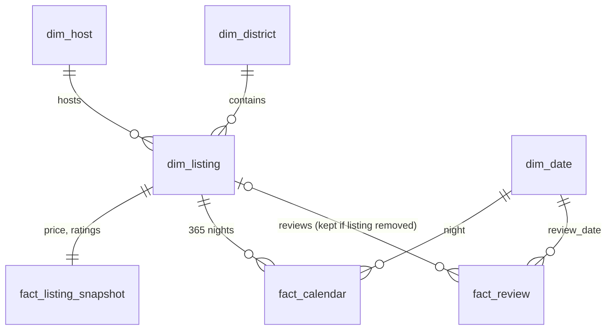

# Munich's Airbnb Market - SQL Analytics Project


**What:** an end-to-end SQL analysis of all 6,865 Airbnb listings in Munich, their 2.5 million calendar days and 237,000 guest reviews (2011-2026).
**How:** a PostgreSQL database in four layers (raw → staging → core → mart), 12 data-quality checks and 12 documented analysis queries, all in SQL.
**Questions:** How big is the market and how fast is it growing? What does Oktoberfest do to demand and prices? Who are the hosts, and how many homes exceed Munich's 8-week rental limit?

---

## Key findings

**Demand has almost tripled since before COVID.** Reviews, the best available proxy for stays, fell by 52% in 2020 and reached 2.8 times the 2019 level in 2025. The first half of 2026 is 6% above the first half of 2025.



**Oktoberfest is visible in both the calendar and the price.** Three months before the event, 72% of all nights during Oktoberfest 2026 were already taken, against 60% in the four weeks before it. Hosts ask about twice the normal price for an entire home during the Wiesn: the median quote is €380 vs €180. September is the strongest month of the year, 54% above an average month.



**Professional hosts earn a disproportionate share.** Hosts with 5 or more listings own 14% of the listings but earn an estimated 30% of the revenue. Their guests also rate them lower: 22% of their listings score below 4.5, against 5% for private single-listing hosts.



**Munich's 8-week rule.** Renting out an entire home for more than 56 nights a year needs a permit in Munich. An estimated 37% of active entire homes are booked above that limit, rising to 55% among professional hosts, and these homes generate 81% of entire-home revenue. *(Estimate from reviews; some hosts hold permits, so this sizes a compliance risk rather than identifying violations.)*



**More facts from the analyses:**
- Ludwigsvorstadt-Isarvorstadt, the district of the Theresienwiese, has 212 listings per km², nearly twice the next district, and about a fifth of the estimated revenue.
- 11% of active listings are booked more than 200 nights a year and generate 40% of all estimated revenue.
- Only 5% of guests have left more than one review, so the market runs on first-time visitors.

---

## What this project demonstrates

| Skill | Where |
|---|---|
| Data cleaning in SQL: `NULLIF`, `CAST`, `REPLACE`, `LIKE`, fixing district names with a join | [`100_stg_listings.sql`](sql/01_staging/100_stg_listings.sql) |
| Star schema: 4 dimensions, 3 fact tables at different grains, primary and foreign keys | [`sql/02_core/`](sql/02_core/) |
| Joins (`INNER`, `LEFT`, `CROSS`, self-join), CTEs, subqueries, `UNION ALL` | [`300_listings.sql`](sql/03_mart/300_listings.sql), [`analysis/`](analysis/) |
| Aggregation: `GROUP BY`, `HAVING`, conditional counts with `CASE WHEN`, medians | [`analysis/`](analysis/) |
| Window functions: `RANK`, `LAG`, shares with `SUM() OVER ()`, rolling 12 months | analyses [02](analysis/02_districts.sql), [04](analysis/04_host_concentration.sql), [05](analysis/05_demand_trend.sql), [`320_reviews_monthly.sql`](sql/03_mart/320_reviews_monthly.sql) |
| Views as a reporting layer for Power BI | [`sql/03_mart/`](sql/03_mart/) |
| Business logic in SQL: occupancy and revenue estimate, Munich's 56-night rule | [`300_listings.sql`](sql/03_mart/300_listings.sql) |
| Data-quality checks as plain queries | [`400_quality_checks.sql`](sql/04_quality/400_quality_checks.sql) |
| Privacy: names and review texts removed before publishing (GDPR data minimisation) | [`etl/prepare_data.py`](etl/prepare_data.py) |

## Analyses

| # | Question | Result |
|---|---|---|
| 01 | How big is the market, by room type? | [csv](results/01_market_overview.csv) |
| 02 | Which districts have the most listings per km², and at what price? | [csv](results/02_districts.csv) |
| 03 | How does the nightly price depend on room type and size? | [csv](results/03_price_drivers.csv) |
| 04 | Private hosts or professional operators? | [csv](results/04_host_concentration.csv) |
| 05 | How did demand develop since 2015 (COVID and recovery)? | [csv](results/05_demand_trend.csv) |
| 06 | Which months are busiest? | [csv](results/06_seasonality.csv) |
| 07 | How full is the calendar during Oktoberfest 2026? | [csv](results/07_oktoberfest_calendar.csv) |
| 08 | What is the Oktoberfest price premium? | [csv](results/08_oktoberfest_price_premium.csv) |
| 09 | How many nights are listings booked, and what do they earn? | [csv](results/09_occupancy_revenue.csv) |
| 10 | How many entire homes exceed the 56-night limit? | [csv](results/10_rule_of_56_nights.csv) |
| 11 | What separates good from great ratings? | [csv](results/11_ratings.csv) |
| 12 | Do guests come back? | [csv](results/12_guests.csv) |

---

## Run it yourself

Requires PostgreSQL 14+ and Python 3.10+.

```bash
git clone https://github.com/<your-user>/munich-airbnb-sql.git
cd munich-airbnb-sql
python -m venv .venv
.venv\Scripts\activate            # macOS/Linux: source .venv/bin/activate
pip install -r requirements.txt
copy .env.example .env            # macOS/Linux: cp .env.example .env  -> then set your password
createdb -U postgres munich_airbnb   # or create the database in pgAdmin
python pipeline.py all            # setup, load, transform, test, analyze, charts, docs (~20 s)
```

**New data:** download a newer Munich snapshot from [Inside Airbnb](https://insideairbnb.com/get-the-data/) into `data/downloads/<date>/`, then run `python pipeline.py prepare --snapshot <date>` (removes personal data) and `python pipeline.py all --snapshot <date>`. The new snapshot replaces the old one.

<details>
<summary><b>Architecture and data model</b></summary>





| Table | Grain | Rows |
|---|---|---|
| `core.dim_listing` | listing | 6,865 |
| `core.dim_host` | host (single / multi / professional) | 5,225 |
| `core.dim_district` | city district with area and polygon | 25 |
| `core.dim_date` | calendar day with Oktoberfest flag | 5,872 |
| `core.fact_listing_snapshot` | listing on the scrape date (price quote, ratings) | 6,865 |
| `core.fact_calendar` | listing × night | 2,505,725 |
| `core.fact_review` | review | 237,201 |
| `mart.listings` (view) | listing, wide, with occupancy and revenue estimates (Power BI source) | 6,865 |

Full column documentation: [`docs/data_dictionary.md`](docs/data_dictionary.md), generated from the database.
</details>

<details>
<summary><b>Data quality: 12 checks, no errors</b></summary>

`python pipeline.py test` runs 12 queries: six must find 0 problem rows (they do), six document known properties of the data. Results: [`results/00_quality_checks.csv`](results/00_quality_checks.csv). Notable findings:
- **Price outliers:** 52 listings quote under €15 or over €2,000 per night (one quotes €78,531). They are flagged and excluded from price statistics.
- **35% of listings have no price**, because Inside Airbnb gets no quote when no dates are bookable. This is documented, not hidden.
- **522 reviews belong to listings that have left Airbnb.** They are kept, because they are real historical demand.
- **District names:** Inside Airbnb spells "Tudering-Riem"; it is mapped to the official *Trudering-Riem* via [`ref/districts.csv`](ref/districts.csv).
- **The own occupancy model agrees with Inside Airbnb's estimate** within 5 nights for 98% of listings.
</details>

<details>
<summary><b>Methodology and limitations</b></summary>

See [`docs/methodology.md`](docs/methodology.md). In short:
- **Demand** is measured by reviews (Inside Airbnb assumes about half of stays are reviewed).
- **Booked nights** = reviews in the last 12 months ÷ 0.5 × 3 nights (or the minimum stay), capped at 255. **Revenue** = nights × quoted price.
- **Price** is a quote for one check-in date per listing. Quotes for Oktoberfest dates are flagged and excluded from "normal" price statistics.
- **Calendar:** "unavailable" means booked *or* blocked by the host. The data cannot tell them apart.
</details>

---

**Data:** [Inside Airbnb](https://insideairbnb.com/), Munich snapshot of 29 June 2026, CC BY 4.0. Host names, profile texts and review texts are removed. **Code:** MIT License.
**Author:** Mark Tereshchenko, M.Sc. Operations Research & Business Analytics
